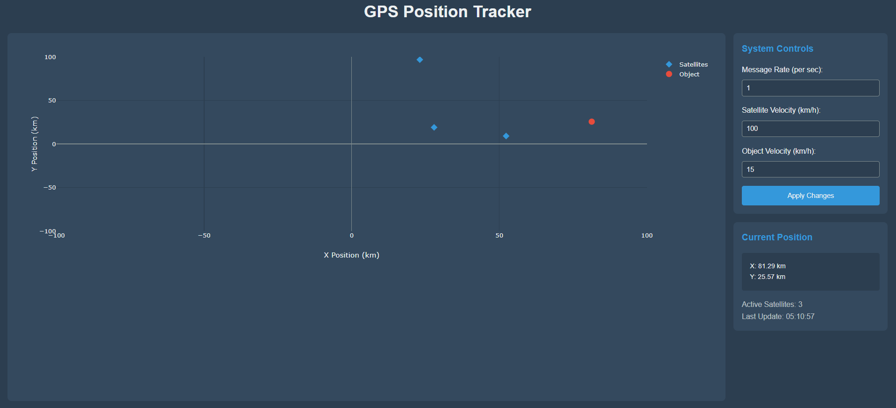
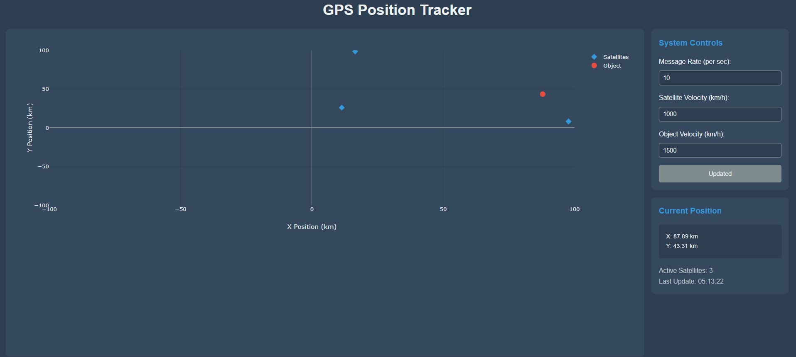

# Лабораторна робота 5: Розробка додатку для візуалізації вимірювань GPS

## Мета роботи
Розробка веб-додатку для візуалізації даних GPS вимірювань у реальному часі з використанням декартової системи координат та можливістю динамічного налаштування параметрів системи через програмний інтерфейс.

## Теоретичні відомості
GPS система використовує метод трилатерації для визначення положення об'єкта у просторі. Візуалізація розташування об'єкта та супутників здійснюється у декартовій системі координат, де відстань вимірюється в кілометрах по осях X та Y. Система працює в реальному часі, постійно оновлюючи дані про положення всіх об'єктів.

## Практична реалізація

### Базовий інтерфейс системи

 

Початковий стан системи з параметрами за замовчуванням

На головному екрані програми відображається координатна площина з діапазоном -100 до 100 кілометрів по обох осях. У правій частині інтерфейсу розташована панель керування з трьома основними параметрами системи: частота оновлення даних (1 повідомлення на секунду), швидкість руху супутників (100 км/год) та швидкість руху об'єкта спостереження (15 км/год).

### Зміна параметрів системи

 

Система при підвищених параметрах швидкості

При збільшенні частоти оновлення до 10 повідомлень на секунду та швидкості руху об'єктів (супутники - 1000 км/год, об'єкт спостереження - 1500 км/год) спостерігається значне підвищення динаміки системи. Рух об'єктів стає більш плавним завдяки частішому оновленню даних, а збільшена швидкість дозволяє краще спостерігати за переміщенням об'єктів у просторі. Система зберігає стабільність роботи навіть при таких підвищених параметрах.

## Висновок
Розроблений додаток успішно виконує поставлені завдання з візуалізації GPS даних у реальному часі. Реалізований інтерфейс дозволяє зручно налаштовувати параметри системи та спостерігати за їх впливом на поведінку об'єктів. Система демонструє стабільну роботу як при низьких, так і при високих швидкостях руху об'єктів та частоті оновлення даних.
